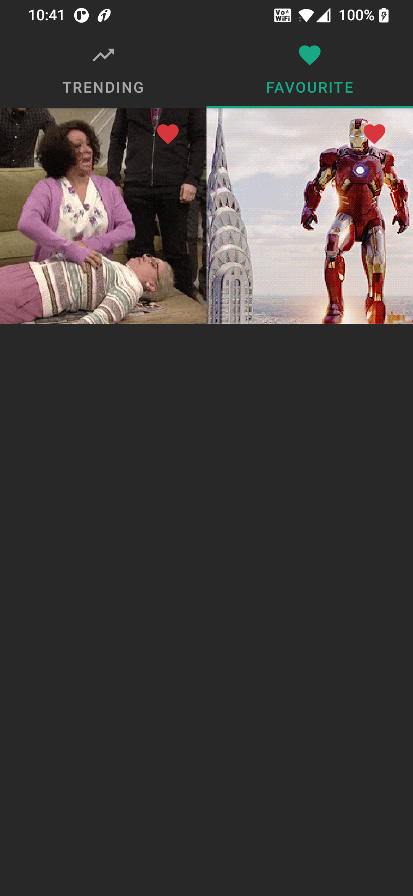

# GifFresh

GifFresh allows you to see trending gifs, It also allows you to search gifs and save to favourite.

GifFresh uses MVVM architecture using Kotlin(100%), Room, Retrofit, DaggerHilt, Coil, Paging, Material Design.

  
   

## Features
- Access to lots of Trending gif
- Support for Dark & Light MODE (Adopts to device configuration)
- Add gifs to Favourite 

## Tools

- Android Studio (version 4.2.2)
- Kotlin (version 1.5.21)
- Gradle (version 4.2.2)
- Github
- PostMan

## ThirdParty Library

- Kotlin-coroutine (version 1.3.2)
- Material Design (version 1.4.0)
- retrofit (version 2.9.0)
- Dagger Hilt (version 2.37)
- Coil (version 1.2.1)
- room (version )
- paging (version 3.0.1)